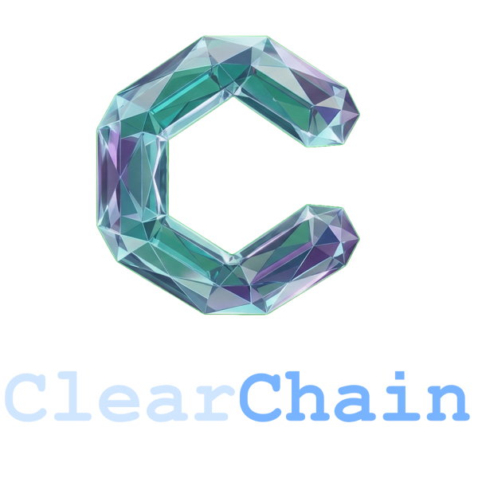

  

# ClearChain

ClearChain is a robust, highly secure, TUI-based Chain of Verification (CoVe) system designed to deliver strictly verified, fact-grounded LLM responses. Built with a focus on privacy and data integrity, ClearChain acts as an interactive AI gateway—leveraging a hybrid architecture that combines local HuggingFace models for security and intent routing with top-tier API models (Gemini, OpenAI, or local Ollama) for reasoning and synthesis.

By forcing the LLM to interrogate its own drafts against a local LanceDB vector knowledge base, ClearChain systematically catches and eliminates hallucinations before they ever reach the user.

## Core Features

* **Chain of Verification (CoVe) Pipeline:** A multi-phase architecture that generates a draft, formulates verification questions, and synthesizes a final, corrected answer based exclusively on local context.
* **Hybrid Local/Cloud AI:** Uses local, lightweight models (DeBERTa for security, MiniLM for routing) to prevent sensitive data leakage and save API costs, while offloading heavy reasoning to your provider of choice.
* **Semantic Caching:** Bypasses redundant API calls by measuring the cosine similarity of new queries against previously verified, cached JSON responses.
* **Strict Credential Management:** API keys are never stored in plain text. ClearChain interfaces directly with your OS keyring (with secure hidden-file fallbacks for headless Linux servers).
* **Terminal User Interface (TUI):** A beautiful, responsive split-pane interface built with Textual, featuring real-time JSON streaming, live logs, and dynamic threshold tuning.
* **Automated Data Integrity:** Includes robust LangChain text chunking, automated schema migrations, and cache invalidation strategies to keep your knowledge base pristine.

## How the CoVe Pipeline Works

ClearChain operates through a strict, multi-step execution pipeline to ensure absolute accuracy:

1. **Phase 0 (Parallel Initialization):** The system concurrently checks the prompt for malicious injection attempts using a local DeBERTa model, classifies the query's domain/tags, and retrieves the highest-scoring vector matches from LanceDB.
2. **Phase 1 (The Draft):** The primary LLM generates an initial, highly confident baseline answer using *only* the retrieved context. (If the draft is short and routed as a simple greeting or refusal, a Fast-Path router skips further verification).
3. **Phase 2 (Interrogation):** The system acts as a strict fact-checker, reviewing the Phase 1 draft and generating specific verification questions targeting its core claims.
4. **Phase 3 (Revision):** The final verification authority methodically answers the Phase 2 questions against the context, catches any hallucinations, corrects the user's false premises, and streams the final, vetted answer to the TUI.

## Documentation

* **Installation & Requirements:** Please see `docs/requirements.md` for dependency installation and local model setup.
* **Key Bindings & TUI Navigation:** Please refer to `docs/key_bindings.md` for a complete list of application shortcuts, database wipe commands, and data entry modals.

## Supported Providers

ClearChain is designed to be completely model-agnostic. You can instantly switch between providers by adjusting your `config.json`:
* **Gemini** (Utilizing the newest `google-genai` SDK)
* **OpenAI** (With native structured JSON output compliance)
* **Ollama** (For a 100% offline, fully local deployment)

## Currently Working On:

* **Security**: Aiming to make ClearChain more robust and secure, outside of what is already there
* **Dependents**: Aiming to cut down things ClearChain is dependent on (ex: LangChain chunking)
* **Testing**: Testing various models to ensure ClearChain is as good as it can get, and testing the quantizations (INT8) of the BERT models

***
